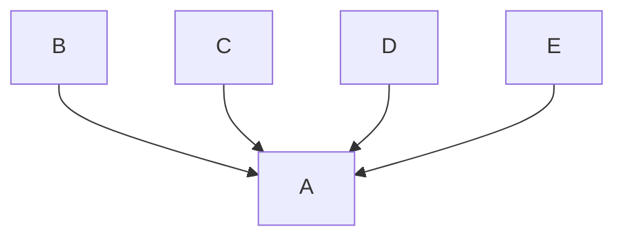

Node js Scalable Module Based rest API using express js
<picture>
 <source media="(prefers-color-scheme: dark)" srcset="YOUR-DARKMODE-IMAGE">
 <source media="(prefers-color-scheme: light)" srcset="YOUR-LIGHTMODE-IMAGE">
 
</picture>
## About me

Hi, I'm Amal Sankar P S.Full Stack Developer

